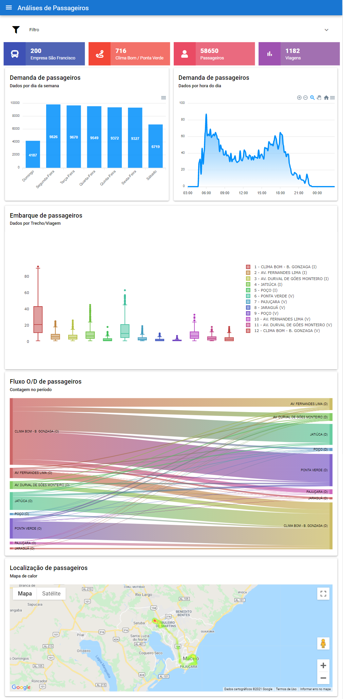

# Análises de dados de passageiros

Este é um projeto criado como Trabalho de Conclusão de Curso de Engenharia Civil da Universidade Federal de Alagoas.
Esta é a estrutura do projeto:

```
  ├── ArquivosEntrada
  │   |── RC (Report Center)
  │   |── TPP (Tempo Por Ponto)
      └── TV (Tempo de Viagem)
  ├── Resultados
  │   |── PassageirosPorPonto
  ├── Scripts para Baixar dados
  |── SistemaWeb (backend)
  └── SistemaWeb (frontend)
```   


## Arquivos de entrada:

[Sistema GoolSystem](https://gool.cittati.com.br/Login.aspx?ReturnUrl=%2f). É necessário fazer download dos arquivos do GoolSystem (Relatórios de Tempo de Viagem e Tempo por Ponto) em `xls (Excel)`.
[Sistema ReportCenter](http://mrc.maceio.prodatamobility.com.br/). É necessário fazer download dos arquivos de Utilização Detalhada por veículo em `csv`.

## Scripts Iniciais

Para Obter os dados de GPS e Bilhetagem eletrônica é necessário rodar o arquivo `main.py`, em seguida o arquivo `open_mrc_detail.py` e, finalmente o arquivo `consolidate_mrc_detail.py`.

Para obter o embarque estimado de passageiros, utilizando a data como chave de junção, é necessário rodar o arquivo `find_local_pass.py`.

## Backend

O Backend foi desenvolvido em Python e utiliza, principalmente, as bibliotecas Django, Pandas e Scikit-learn. Para mais detalhes acesse a [página específica do backend](backend)

## Frontend

O Frontend foi desenvolvido em JavaScript e utiliza, principalmente, os frameworks Vue e Quasar. Para mais detalhes acesse a [página específica do frontend](frontend)


## Contribuindo

Por favor, verifique se a mudança já não está em desenvolvimento em issues e, caso seja feita alguma mudança, a solicitação deve ocorrer via pull request.


